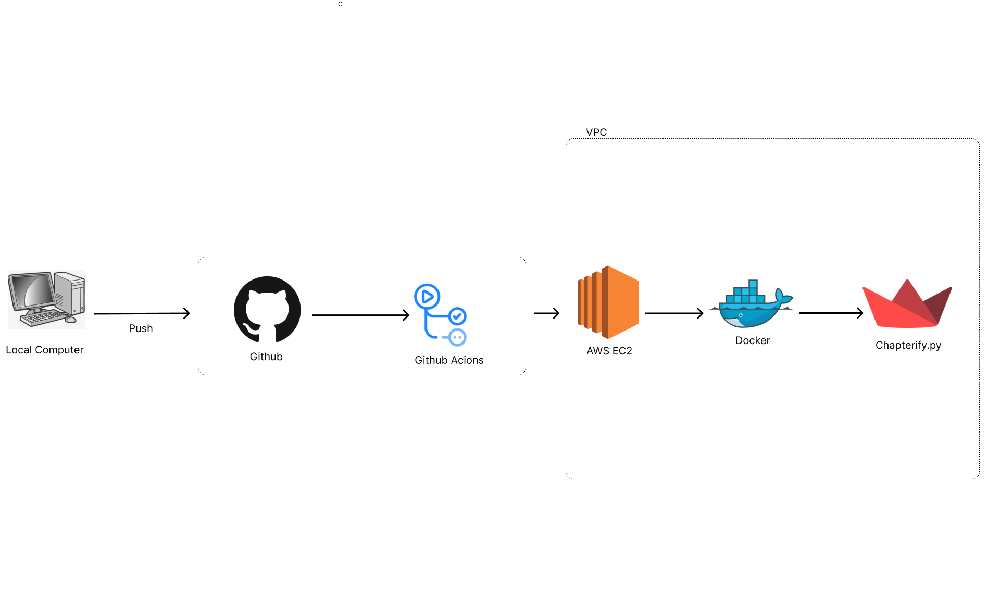
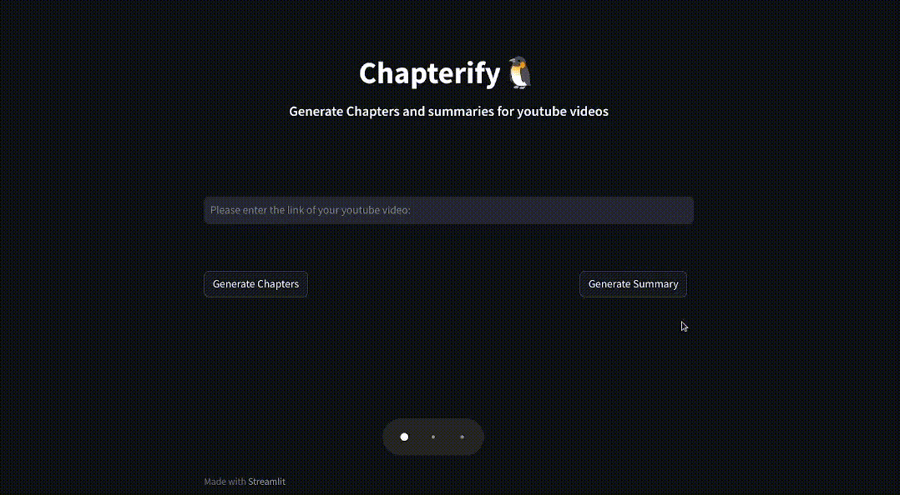

# Chapterify
This is a Streamlit Applicaion that generates chapters and sumaries for youtube videos using Streamlit and GPT-4.
It runs on a docker container in and AWS EC2 instance that had Continuous Deployment by Github Actions.

## Archiecture


## Demo



## Environment Variables

To run this project, you will need to add your GPT-4 API key to the following environment variables to your .env file

`MY_OPENAI_KEY`

## Run Locally

Clone the project
```bash
  git clone https://github.com/ShrithikShahapure/Chapterify.git
```

Go to the project directory

```bash
  cd Chapterify
```

Install dependencies

```bash
  pip install -r requirements.txt
```


Execute the program

```bash
 streamlit run main.py
```

## Run on Docker

Clone the project
```bash
  git clone https://github.com/ShrithikShahapure/Chapterify.git
```

Go to the project directory

```bash
  cd Chapterify   docker build -t my_web_app .

```

Build the Docker Image

```bash
  docker build -t Chapterify .

```

Run the Docker Container

```bash
  docker run -d -p 8051:8051 Chapterify

```

Get the URL of the application

```bash
  docker logs [container_name]

```


